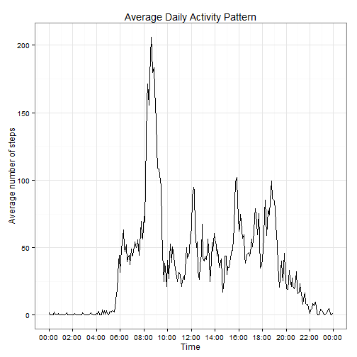
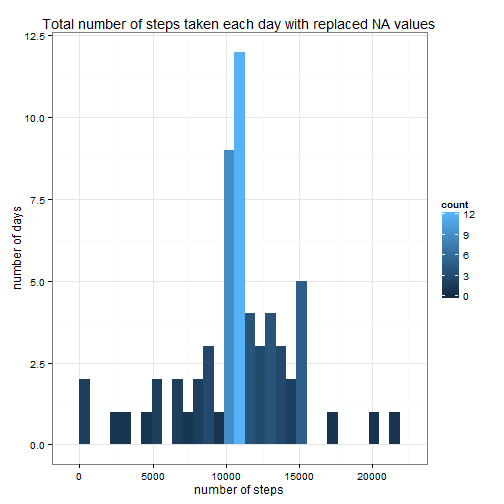
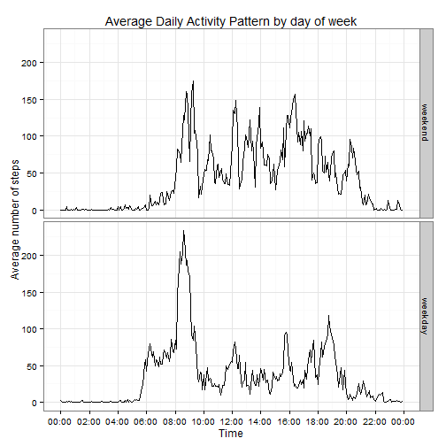

## Loading and preprocessing the data

Reading zipped activity.csv


```r
activity <- read.csv(unz("activity.zip", "activity.csv"), colClasses = 
                             c("integer", "Date", "integer"))
```

Loading libraries that will be required for analysis and graphs building


```r
library(ggplot2)
library(lubridate)
library(scales)
library(dplyr)
```

## What is mean total number of steps taken per day?

Counting total steps for each day.
Note: aggregate function ignores NA by default.


```r
total.steps <- aggregate(steps ~ date, data = activity, FUN = sum)
```

Build histogram of steps

```r
ggplot(total.steps, aes(x=steps)) + geom_histogram(aes(fill = ..count..)) + 
        theme_bw() + 
        labs(title = "Total number of steps taken each day", 
             x = "number of steps", y = "number of days")
```

 


```r
mean.steps <- mean(total.steps$steps)
median.steps <- median(total.steps$steps)
```

Mean of the total number of steps taken per day is 10766.19  
Median of the total number of steps taken per day is 10765

## What is the average daily activity pattern?

###Processing data for plotting.
Aggregating, then converting interval to time for the sake of plotting.
Timezone is explicitly set to "UTC" to ensure that the same timezone is used in strptime() and date_format() functions.


```r
# aggregating by interval
avg.daily.activity <- aggregate(steps ~ interval, data = activity, FUN = mean)
# converting int to character to add missing zeroes for time conversion
avg.daily.activity$interval <- as.character(avg.daily.activity$interval)
# vector containing number length of interval string
nchar <- nchar(avg.daily.activity$interval)
# adding zeroes depending of interval string length
avg.daily.activity$interval[nchar == 1] <- paste('000', avg.daily.activity$interval[nchar == 1], sep = '')
avg.daily.activity$interval[nchar == 2] <- paste('00', avg.daily.activity$interval[nchar == 2], sep = '')
avg.daily.activity$interval[nchar == 3] <- paste('0', avg.daily.activity$interval[nchar == 3], sep = '')
# now we can use lubridate to convert to time
avg.daily.activity$interval <- strptime(avg.daily.activity$interval, "%H%M", tz = "UTC")
```

###Plotting the data.

Here formatting time appropriately for plotting using scales library.


```r
ggplot(avg.daily.activity, aes(interval, steps)) + geom_line() + scale_x_datetime(breaks = date_breaks("2 hours"),labels = date_format("%H:%M", tz="UTC")) + theme_bw() + labs(title = "Average Daily Activity Pattern", x = "Time", y = "Average number of steps")
```

 

###5 min interval with max average number of steps


```r
most.active.interval <- as.character.Date(avg.daily.activity$interval[which.max(avg.daily.activity$steps)], 
                                          format = "%H:%M")
```

5-minutes interval starting at 08:35 contains the maximum number of steps on average across all the days in the dataset

## Imputing missing values

###Total number of missing values in the dataset


```r
nas.total <- sum(is.na(activity$steps))
```

Total number of missing values is 2304

### Fill in the missing values

The strategy is to replace NA with the average amount of steps for that 5-minute interval across all the days.


```r
# count average activity for each interval
avg.activity <- aggregate(steps ~ interval, data = activity, FUN = mean)
# modify column names to join only by interval
colnames(avg.activity) <- c("interval","mean.steps")
# join by interval column
act.no.nas <- inner_join(activity, avg.activity)
# replace steps where NAs by rounded mean value
act.no.nas[is.na(act.no.nas$steps),]$steps <- round(act.no.nas[is.na(act.no.nas$steps),]$mean.steps)
```

### Histogram on modified data

Build histogram of steps on modified data


```r
total.steps.no.na <- aggregate(steps ~ date, data = act.no.nas, FUN = sum)
ggplot(total.steps.no.na, aes(x=steps)) + geom_histogram(aes(fill = ..count..)) + 
        theme_bw() + 
        labs(title = "Total number of steps taken each day with replaced NA values", 
             x = "number of steps", y = "number of days")
```

 

### Mean and median of the modified dataset


```r
mean.steps <- mean(total.steps.no.na$steps)
median.steps <- median(total.steps.no.na$steps)
```

Mean of the total number of steps taken per day is 10765.64  
Median of the total number of steps taken per day is 10762

The strategy to replace missing values was to replace them by all days average for this particular interval.
That led to mean and median not changing.
Change for the histogram - bar corresponding to the mean of distibution increased because NAs weren't introduced randomly but there were days of NA. All other bars remained intact.

## Are there differences in activity patterns between weekdays and weekends?

Create a factor corresponding to the day of week with two levels - weekday and weekend.
And then add it to the data to plot using the same conversions as previously for time series plot.

```r
wday <- wday(activity$date)
wday[wday == 1 | wday == 7] <- 1
wday[wday > 1] <- 2
wday_factor <- factor(wday, labels = c("weekend", "weekday"))

act.by.wday <- cbind(activity, wday_factor)
avg.activity.by.wday <- aggregate(steps ~ interval + wday_factor, data = act.by.wday, FUN = mean)
# converting int to character to add missing zeroes for time conversion
avg.activity.by.wday$interval <- as.character(avg.activity.by.wday$interval)
# vector containing number length of interval string
nchar <- nchar(avg.activity.by.wday$interval)
# adding zeroes depending of interval string length
avg.activity.by.wday$interval[nchar == 1] <- paste('000', avg.activity.by.wday$interval[nchar == 1], sep = '')
avg.activity.by.wday$interval[nchar == 2] <- paste('00', avg.activity.by.wday$interval[nchar == 2], sep = '')
avg.activity.by.wday$interval[nchar == 3] <- paste('0', avg.activity.by.wday$interval[nchar == 3], sep = '')
# now we can use lubridate to convert to time
avg.activity.by.wday$interval <- strptime(avg.activity.by.wday$interval, "%H%M", tz = "UTC")
```

###Plotting
The only difference with the previous time series plot is that we use wday_factor as an argument to facet_grid()


```r
ggplot(avg.activity.by.wday, aes(interval, steps)) + geom_line() + scale_x_datetime(breaks = date_breaks("2 hours"),labels = date_format("%H:%M", tz="UTC")) + theme_bw() + labs(title = "Average Daily Activity Pattern by day of week", x = "Time", y = "Average number of steps" )+ facet_grid(wday_factor ~ .) 
```

 

So we can see that on weekends the subject is generally equally active during the day than on weekdays when we see burst of activity in the morning and then significantly less during the rest of the day. Also on the weekdays the activity starts earlies than on weekends which is not very surprising. 
